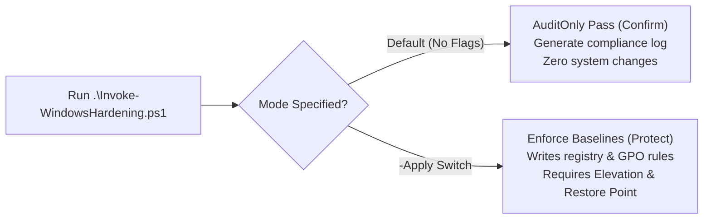

# HardenSecurity — Windows Defensive Hardening Orchestrator

> **Automated PowerShell orchestrator for offline installation, compliance auditing, and baseline enforcement of Microsoft Security Baselines and Attack Surface Reduction (ASR) rules.**

[](#)
[](#)
[](#)
[](LICENSE)

---

## 🛡️ Purpose & Defensive Scope

`HardenSecurity` provides a controlled, offline-capable orchestration layer for hardening Windows workstations against modern exploit techniques. It wraps and executes the comprehensive `Harden-Windows-Security` module across **13 key security categories**:

1. **Microsoft Security Baselines:** Standardized Group Policy and registry baselines.
2. **Attack Surface Reduction (ASR):** Blocks credential theft from LSASS, child process spawning by Office apps, and obfuscated script executions.
3. **Microsoft Defender Antivirus:** Enables cloud-delivered protection, PUA blocking, and sandboxed inspection.
4. **DeviceGuard & CredentialGuard:** Virtualization-based security (VBS) configuration.
5. **BitLocker Drive Encryption:** Cryptographic DMA protection and TPM validation.
6. **TLS & Protocol Security:** Disables insecure legacy protocols (SSL 3.0, TLS 1.0, TLS 1.1) and enforces TLS 1.2/1.3.
7. **Windows Firewall:** Restricts inbound exceptions and ensures strict domain/private/public profiles.
8. **User Account Control (UAC):** Enforces secure desktop prompting and admin approval mode.
9. **Exploit Protection (Process Mitigations):** System-wide DEP, ASLR, and Control Flow Guard (CFG).
10. **Windows Networking:** Hardens NetBIOS, LLMNR, and SMBv1 attack surface.
11. **Lock Screen Security:** Disables voice assistants and camera on locked screens.
12. **Optional Windows Features:** Strips deprecated legacy packages (Telnet, TFTP, PowerShell 2.0).
13. **Microsoft 365 Security Baselines:** Hardens Office runtime execution macros.

---

## 🔒 Safety First: AuditOnly by Default

To prevent unintended workstation disruptions, the script runs in **`AuditOnly` (Confirm)** mode by default. It surveys system state, compares current settings against baselines, and logs compliant vs non-compliant items without modifying system state.



---

## 💻 Usage & Execution

### 1. Compliance Audit Mode (Safe — Recommended First Step)
Runs read-only verification across all 13 categories:
```powershell
# Open elevated PowerShell 7 terminal
Set-ExecutionPolicy -ExecutionPolicy Bypass -Scope Process -Force

.\Invoke-WindowsHardening.ps1
# Results saved to C:\Logs\Hardening\
```

### 2. Enforcement Mode (Applies Changes)
Enforces all hardening baselines:
```powershell
# Always create a System Restore point first:
Checkpoint-Computer -Description "Before_HardenSecurity" -RestorePointType "MODIFY_SETTINGS"

# Apply hardening baselines:
.\Invoke-WindowsHardening.ps1 -Apply
```

---

## 📋 System Requirements & Compatibility

- **Verified Operating Systems:**
  - Windows 11 Enterprise / Pro (22H2, 23H2, 24H2) — *Full Support (VBS & DeviceGuard active)*.
  - Windows 10 Enterprise / Pro (21H2, 22H2) — *Supported (Category availability varies by hardware)*.
- **PowerShell Version:** PowerShell 5.1 or PowerShell 7+ running with local Administrator privileges.
- **Hardware Prerequisites:** UEFI Secure Boot and TPM 2.0 enabled for BitLocker / DeviceGuard categories.

---

## 🔄 Rollback & Recovery Strategy

1. **System Restore Point:** The primary rollback mechanism is restoring from the pre-execution snapshot.
2. **Audit Logging:** Full verbose logs of all altered keys and registry values are written to `C:\Logs\Hardening\` with UTC timestamps.
3. **Category Isolation:** The script allows individual category auditing if a specific baseline causes software incompatibility.

---

## 📚 Upstream Dependency & Attribution

This orchestrator relies on the open-source [Harden-Windows-Security](https://github.com/HotCakeX/Harden-Windows-Security) PowerShell module developed by HotCakeX (licensed under MIT). All upstream rights and core baseline definitions remain with their respective authors.

---

## 👤 Author

- **Iker Nistal Fernandez** ([@Niistal](https://github.com/Niistal))
